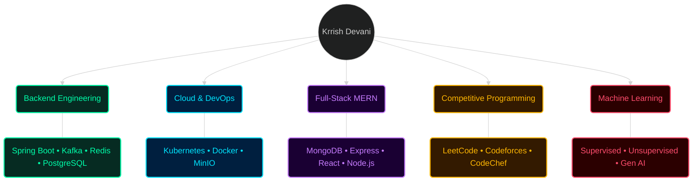

<div align="center">


<a href="https://git.io/typing-svg">
  
</a>

</div>

---

### `whoami`

```json
{
  "name": "Krrish Devani",
  "role": "Backend Engineer & Systems Builder",
  "education": "B.Tech in Information and Communication Technology (ICT)",
  "university": "Pandit Deendayal Energy University (PDEU), Gandhinagar, India",
  "year": "3rd Year — Expected Graduation 2028",
  "philosophy": "Ship real products. Use AI as a force multiplier, not a crutch."
}
```

<br/>

## 🛠️ Tech Arsenal

<div align="center">

**Languages, Backend & Data**


**MERN / Full-Stack**


**Cloud & DevOps**


</div>

<div align="center">

</div>

<br/>

## 🧠 Knowledge Graph

<div align="center">



</div>

<br/>

## 🏆 Competitive Programming Profiles

<div align="center">

<a href="https://leetcode.com/u/Krrish_Devani/"></a>
&nbsp;&nbsp;&nbsp;
<a href="https://codeforces.com/profile/Krrish_Devani"></a>
&nbsp;&nbsp;&nbsp;
<a href="https://www.codechef.com/users/krrish_devani"></a>

</div>

<br/>

## 📈 GitHub Analytics

<div align="center">


</div>

<br/>

### 🏅 Trophy Case

<div align="center">


</div>

<br/>

### 🐍 Contribution Snake

<div align="center">


</div>

<br/>

## 🌐 Connect With Me

<div align="center">

<a href="https://www.linkedin.com/in/krrish-devani-121076323/"></a>
&nbsp;&nbsp;&nbsp;
<a href="https://x.com/DevaniKrrish"></a>
&nbsp;&nbsp;&nbsp;
<a href="https://www.instagram.com/devani.krrish/"></a>

</div>

<br/>

<div align="center">


**"Ship real products. Use AI as a force multiplier, not a crutch."**

</div>
